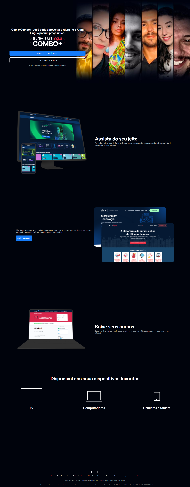

# Site Alura Plus

Site desenvolvido com **HTML e CSS** para a aula da **Alura**.

---

## 📸 Preview



---

## 🚀 Tecnologias usadas
- HTML5
- CSS3
- JavaScript
- PHP

---

## ✅ Funcionalidades
- [x] Página inicial
- [x] Formulário de contato
- [x] Site responsivo
- [x] Segurança

---

## ▶️ Como rodar o projeto (local)

1. Clone o repositório:
   ```bash
   git clone https://github.com/MaykiDev/siteifct.github.io.git